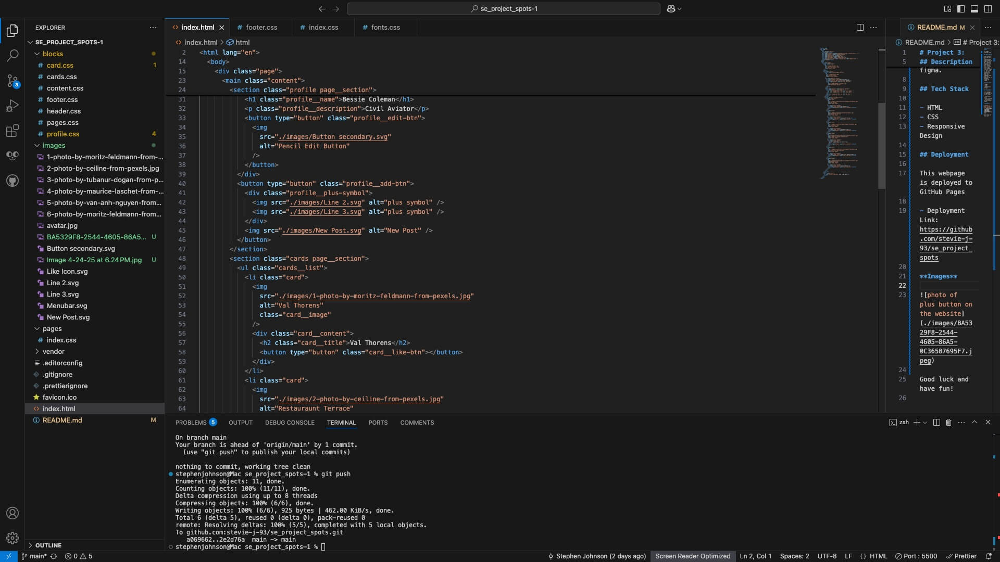
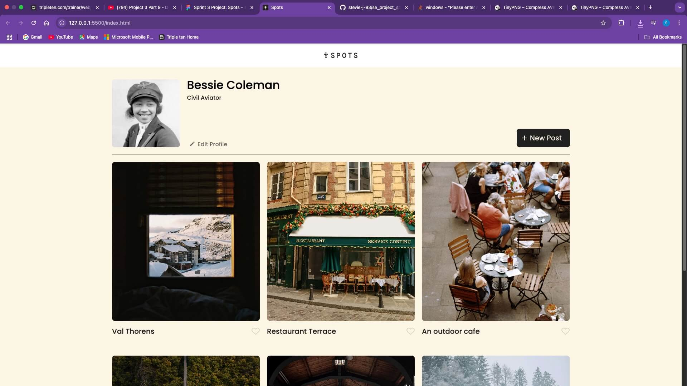

# Project 3: Spots

An image sharing site.

## Description

This project was the start to understanding the aspects of what it is to be a software engineer. We were tasked with learning how to work with figma, and how to use it as a guide to our css properties, and how to make the webpage work and look exactly how it presents itself on figma.

## Tech Stack

- HTML
- CSS
- Responsive Design

## Deployment

This webpage is deployed to GitHub Pages

- Deployment Link: https://stevie-j-93.github.io/se_project_spots/

## Video Description

Video: https://drive.google.com/file/d/18HtToVAlGNPth-a8zfs63RhvteByNXkN/view?usp=sharing

**Images**

